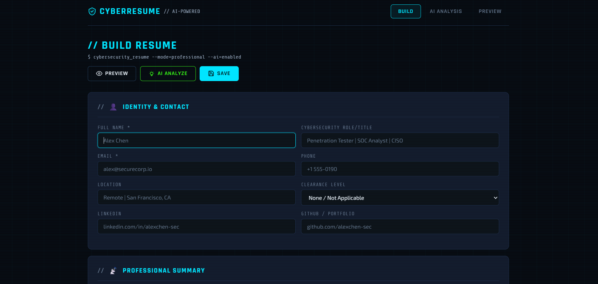
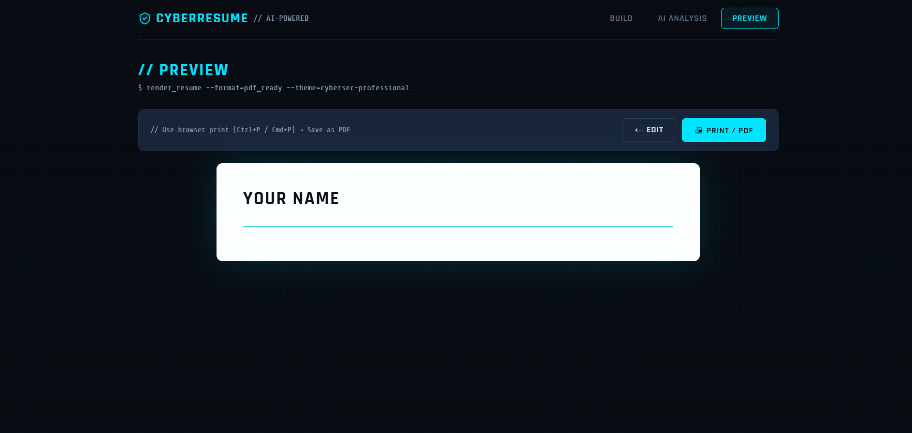

# 🛡️ CyberResume — AI-Powered Cybersecurity Resume Builder

Build professional cybersecurity resumes with AI-powered analysis, ATS optimization, and a clean print-ready design—all in your browser.

> Designed for Penetration Testers, SOC Analysts, Security Engineers, GRC Professionals, Incident Responders, Cloud Security Engineers, DevSecOps Engineers, and aspiring cybersecurity professionals.

---

## 🚀 Live Demo

🌐 **Try CyberResume Online**

**https://preferred-harlequin-qovpsqix.edgeone.dev/**

> Replace the link above with your GitHub Pages, Vercel, or Netlify deployment URL.

---

# ✨ Features

## 📝 Build Your Resume

Create a professional cybersecurity resume using a structured form.

### 👤 Identity & Contact

- Full Name
- Professional Title
- Email Address
- Phone Number
- Location
- Security Clearance
- LinkedIn
- GitHub
- Portfolio Website

---

### 💼 Professional Summary

Create a concise cybersecurity-focused summary highlighting your experience, certifications, and technical strengths.

---

### 💻 Work Experience

- Add unlimited experience entries
- Remove entries instantly
- Company
- Position
- Duration
- Responsibilities
- Achievements

---

### 🚀 Projects

Showcase security projects such as:

- Penetration Testing
- Web Application Security
- Network Security
- Malware Analysis
- Digital Forensics
- TryHackMe Labs
- Hack The Box
- Bug Bounty
- CTF Challenges
- Security Automation
- SIEM Projects

---

### 🎓 Education

- Degree
- University
- Graduation Year
- GPA (Optional)

---

### 🛠 Skills

Skills automatically display as modern chips.

Examples:

- Penetration Testing
- Web Security
- Network Security
- Linux
- Kali Linux
- Python
- Bash
- PowerShell
- Burp Suite
- Nmap
- Metasploit
- Wireshark
- OWASP Top 10
- Active Directory
- SIEM
- Splunk
- Microsoft Sentinel
- Azure
- AWS
- Docker
- Kubernetes
- Incident Response
- Threat Hunting

---

## 🤖 AI Resume Analysis

Powered by Claude AI.

CyberResume analyzes your resume like an experienced cybersecurity recruiter.

AI feedback includes:

- Resume Score
- ATS Compatibility
- Missing Keywords
- Professional Summary Review
- Skills Review
- Experience Review
- Project Review
- Education Review
- Resume Strengths
- Weaknesses
- Improvement Suggestions
- Hiring Recommendation

---

## 👀 Resume Preview

Generate a professional resume preview.

Features:

- Clean Layout
- Print Ready
- PDF Export
- Responsive Design
- Professional Typography

Export using:

```
Ctrl + P
```

or

```
Cmd + P
```

---

## 💾 Local Auto Save

Your resume is automatically saved using:

```
localStorage
```

Storage Key:

```
cyberresume_v2
```

No login required.

No database required.

No cloud storage.

---

# 🖥 Screenshots

## Build Tab



---

## Preview Tab



---

# ⚡ Tech Stack

- HTML5
- CSS3
- Vanilla JavaScript
- Google Fonts
- Anthropic Claude API

No framework.

No React.

No Vue.

No Angular.

No backend required.

---

# 📂 Project Structure

```
CyberResume/
│
├── cybersec-resume-builder.html
├── build-tab.png
├── preview-tab.png
└── README.md
```

---

# 🚀 Getting Started

## Clone Repository

```bash
git clone https://github.com/yourusername/CyberResume.git
```

---

## Open Project

Simply open:

```
cybersec-resume-builder.html
```

in any modern browser.

No installation required.

No dependencies.

---

# 🤖 AI Analyze Setup

CyberResume uses the Anthropic Messages API.

API Endpoint:

```
https://api.anthropic.com/v1/messages
```

To enable AI:

1. Create an Anthropic API Key.
2. Use your own backend or proxy.
3. Do NOT expose your API key in client-side JavaScript.
4. Deploy securely.

---

# 🔒 Privacy

Your resume stays on your device.

Resume data is only sent to Claude when you click:

```
AI Analyze
```

Otherwise:

- No cloud storage
- No tracking
- No user accounts
- No database

---

# 🎯 Perfect For

- Penetration Testers
- Ethical Hackers
- SOC Analysts
- Security Engineers
- DevSecOps Engineers
- Cloud Security Engineers
- Threat Hunters
- Incident Responders
- Digital Forensics Analysts
- Malware Analysts
- GRC Professionals
- Students
- TryHackMe Users
- Hack The Box Users
- Bug Bounty Hunters

---

# 🌟 Future Features

- Dark Mode
- Multiple Resume Templates
- Resume Themes
- AI Resume Rewrite
- AI Cover Letter Generator
- ATS Score Dashboard
- Resume Version History
- Import from LinkedIn
- Import from PDF
- Markdown Resume Export
- DOCX Export
- One-Click PDF Export
- Multiple Language Support

---

# ⭐ Why CyberResume?

- AI-powered cybersecurity resume analysis
- ATS-friendly recommendations
- Beautiful cyber-themed UI
- Lightweight
- Fast
- Fully client-side
- No installation
- Open Source

---

# 🤝 Contributing

Contributions are welcome.

1. Fork the repository.
2. Create a feature branch.
3. Commit your changes.
4. Push your branch.
5. Open a Pull Request.

---

# 📜 License

This project is licensed under the MIT License.

---

# 👨‍💻 Author

**Kunal Kore**

Cybersecurity Student • Penetration Testing Enthusiast • Ethical Hacker

GitHub:

https://github.com/yourusername

LinkedIn:

https://linkedin.com/in/yourusername

Portfolio:

https://yourportfolio.com

---

## ⭐ Support

If you found this project helpful,

⭐ Star this repository

and share it with the cybersecurity community.

---

> **Build stronger resumes. Land better cybersecurity roles.**
